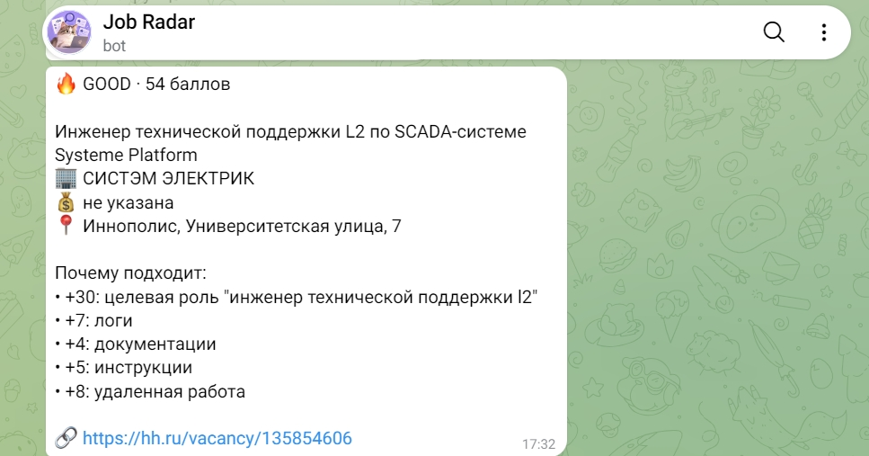

# Job Radar

Персональный сервис для автоматизации поиска вакансий.

Job Radar собирает вакансии с hh.ru через HTML-парсинг страниц, фильтрует их по заданным критериям, оценивает релевантность и отправляет подходящие варианты в Telegram.

## Что умеет

- искать вакансии по нескольким направлениям;
- учитывать заданные регионы и удалённый формат работы;
- исключать неподходящие вакансии по заданным критериям;
- анализировать и оценивать релевантность вакансий;
- отправлять подходящие вакансии в Telegram;
- запоминать уже отправленные вакансии и не присылать их повторно;
- автоматически запускаться по расписанию через GitHub Actions.

## Как работает

Сервис последовательно проходит несколько этапов:

`Поиск вакансий → Фильтрация → Обогащение данных → Скоринг → AI (опционально) → Telegram`

Каждый этап вынесен в отдельную часть проекта, что позволяет независимо изменять логику поиска, фильтрации и оценки вакансий.

### Пример результата

Так выглядит вакансия после обработки и оценки релевантности:



## Технологии

- Python
- Requests
- HTML-парсинг hh.ru (Requests и BeautifulSoup)
- Telegram Bot API
- Git / GitHub
- GitHub Actions

## Структура проекта

- `main.py` — запуск сбора вакансий;
- `hh_search.py` — поиск вакансий;
- `filters.py` — фильтрация результатов;
- `enrich.py` — дополнительная обработка данных;
- `scoring.py` — оценка релевантности вакансий;
- `ai_analyzer.py` — структурированный анализ относительно `career_profile.json`;
- `vacancy_state.py` — общий отбор вакансий, ранжирование и история отправок;
- `send_telegram.py` — отправка результатов в Telegram;
- `config.py` — поисковые запросы и настройки;
- `sent_vacancies.json` — история уже отправленных вакансий;
- `.github/workflows/job-radar.yml` — автоматический запуск проекта.

## Автоматизация

Job Radar запускается автоматически через GitHub Actions.

После каждого запуска сервис:

1. получает свежие вакансии;
2. фильтрует результаты;
3. рассчитывает релевантность;
4. отправляет новые подходящие вакансии в Telegram;
5. сохраняет историю отправленных вакансий.

Также workflow можно запустить вручную через GitHub Actions.

## Безопасность

Токен Telegram-бота и Chat ID не хранятся в коде проекта. Для запуска через GitHub Actions используются GitHub Secrets.

## О проекте

Проект создан как собственный инструмент для автоматизации поиска работы.

## Job Radar AI: двухэтапная оценка

Первый этап остаётся бесплатным: `scoring.py` сохраняет `score`, `category`,
`positive_reasons`, `negative_reasons` в `scored_vacancies.json`.
AI рассматривает только новые HOT/GOOD с описанием минимум 100 символов.
MAYBE/SKIP, уже отправленные ID и дубликаты не расходуют запросы.

Второй этап использует OpenAI Python SDK, Responses API и строгую JSON Schema.
Модель по умолчанию — `gpt-5-nano`. Профиль кандидата берётся из
`career_profile.json`; обновляйте его при изменении опыта и предпочтений.
Модель должна отличать реальные навыки от знакомства с инструментами,
обязательные требования от желательных и явно отмечать неизвестные условия.
Учитываются удалёнка, зарплата, английский, клиентское общение и дежурства.
Текст вакансии передаётся как недоверенные данные.

Результат — `ai_vacancies.json`, исходные поля сохраняются без изменения:

- `ai_score`: число 0–100; без успешного анализа — `null`;
- `ai_recommendation`: APPLY / CONSIDER / SKIP; без анализа — `null`;
- `ai_strengths`, `ai_gaps`: до трёх кратких пунктов;
- `ai_reason`: краткое объяснение по-русски, включая неопределённость;
- `ai_status`: `success`, `disabled`, `not_eligible`, `insufficient_data`,
  `limit_reached`, `unavailable` или `error`.

Telegram ставит APPLY выше CONSIDER и сортирует внутри группы по `ai_score`,
затем по исходному `score`. Успешный AI SKIP исключается из рассылки.
Вакансии без AI-оценки идут после AI-рекомендаций по обычному скорингу.
При выключенном AI используется исходный `scored_vacancies.json`.
При отсутствии AI-файла также используется исходный скоринг.
В сообщениях видны обе оценки, рекомендация, до трёх причин и ограничения.
Никакой автоматический отклик на вакансии не выполняется.

## Настройки

| Переменная | По умолчанию | Назначение |
| --- | --- | --- |
| `AI_ENABLED` | `false` | AI включён только при значении `true` |
| `AI_MAX_VACANCIES` | `20` | Лимит запросов за запуск, от 0 до 20; больше 20 обрезается, отрицательное/некорректное значение отключает запросы |
| `OPENAI_MODEL` | `gpt-5-nano` | Модель с поддержкой Responses, JSON Schema и reasoning effort low |
| `OPENAI_API_KEY` | отсутствует | OpenAI API-ключ; при отсутствии — fallback |
| `TELEGRAM_BOT_TOKEN` | отсутствует | Токен существующего Telegram-бота |
| `TELEGRAM_CHAT_ID` | отсутствует | Получатель рассылки |

Для локального запуска переменные должны быть экспортированы в окружение;
`.env` автоматически не загружается. Не сохраняйте секреты в код, JSON или Git.
Для GitHub используйте Secrets `OPENAI_API_KEY`, `TELEGRAM_BOT_TOKEN`,
`TELEGRAM_CHAT_ID`. Обычные настройки — Repository variables в
Settings → Secrets and variables → Actions → Variables.
Если `AI_ENABLED` не задана, AI остаётся выключенным после будущего объединения в main.
Для ежедневного включения установите Repository variable `AI_ENABLED=true`;
для отключения — `false`.

## Первый ручной запуск в GitHub Actions

Изменения необходимо сначала сохранить и отправить в `feature/ai-analyzer`.
Ветки разошлись: перед будущим объединением отдельно проверьте изменения
`main`, особенно `sent_vacancies.json`. Автоматическая синхронизация не выполняется.
История feature-ветки согласована с main на момент этой доработки объединением
всех ID из обеих веток. Если main продолжает рассылку, история снова может отстать:
**перед реальной рассылкой согласуйте историю отправок**, иначе уже отправленные
в main вакансии могут повториться.
Не очищайте этот файл. Рассылка проверяет историю выбранной ветки.

1. Проверьте профиль кандидата, актуальную историю отправок и GitHub Secrets.
2. Откройте Actions → Job Radar → Run workflow, выберите `feature/ai-analyzer`.
3. Для проверки старой схемы оставьте `ai_enabled` выключенным.
4. Для первого платного AI-запуска включите `ai_enabled`, задайте
   `ai_max_vacancies=3` и запустите workflow вручную после проверки кода.
5. Проверьте лог шага Analyze promising vacancies with AI и сообщения бота.
   `success` подтверждает AI-ответ; `unavailable`/`error` означает fallback.
6. Включайте ежедневный AI только после успешной проверки и отдельного
   согласования объединения ветки. Ручной запуск сам по себе не включает AI по расписанию.

Ручной переключатель имеет приоритет над Repository variable: выключенный
`ai_enabled` гарантирует отсутствие AI-запросов именно в этом ручном запуске.
Ручной workflow выполняет настоящую рассылку в Telegram, даже если AI выключен.
Ежедневное расписание сохранено: `17 6 * * *` (06:17 UTC / 10:17 Asia/Yerevan).
Запуски workflow сериализованы, чтобы одновременно не менять историю.
GitHub запускает расписание для default branch; изменение feature-ветки его не переключает.

## Ограничения расходов и fallback

- Максимум 20 вызовов за запуск, включая неудачные; для первого ручного запуска
  предложен лимит 3. Лимит отправки Telegram независимо остаётся 20.
- Тайм-аут OpenAI — 45 секунд, автоматические повторы SDK выключены.
  При ошибке API/транспорта следующие запросы в этом запуске прекращаются.
- Описание обрезается до 12 000 символов с явным указанием усечения модели;
  ответ ограничен 2 000 токенами, включая reasoning. Усечённые/невалидные
  ответы и отказы не используются как успешные оценки и не перезапрашиваются.
- В логах только количество запросов, ошибок и предоставленные API input/output
  tokens. Токены неудачных вызовов без ответа могут быть неизвестны; это не
  точный денежный отчёт. Описание, профиль, ключи и тела исключений не логируются.
- Отсутствие ключа/SDK, ошибка загрузки профиля или временная ошибка API
  сохраняют отправку по обычному скорингу. AI-оценка вероятностна и может ошибаться.
- Наличие 100 символов — лишь минимальный фильтр достаточности данных;
  неизвестные условия модель должна отметить, а итог стоит проверить вручную.
- ID записывается атомарно только после успешного подтверждения Telegram.
  Подтверждение — JSON-объект с `ok=true` и объектом `result`, содержащим
  положительный целочисленный `message_id`. Сетевые/HTTP-ошибки, некорректный JSON
  и ответы без подтверждения не добавляют ID в историю. Ошибки уведомлений
  обрабатываются безопасно; их неудачная доставка не блокирует попытки отправки вакансий.
  Повреждённая история останавливает этап вместо риска повторной отправки.
  Тайм-аут после фактического принятия сообщения Telegram и авария между
  отправкой и записью ID не позволяют гарантировать exactly-once доставку.

## Локальные проверки без платных запросов и рассылки

```sh
python -m venv .venv
# Windows: .venv\Scripts\activate; Linux/macOS: source .venv/bin/activate
python -m pip install -r requirements.txt
python -m unittest discover -s tests -p '*_test.py' -v
python -m compileall -q main.py filters.py enrich.py scoring.py ai_analyzer.py send_telegram.py vacancy_state.py tests sources
```

Тесты имитируют AI-ответы, включая проверку реального SDK через локальный
MockTransport; Telegram заменяется mock. Проверяются лимиты, неполные описания,
ошибки API, отсутствие ключа, JSON-совместимость, ранжирование, дедупликация и
запись истории после успеха. `python ai_analyzer.py` при `AI_ENABLED=false`
только создаёт AI-файл с выключенными оценками. В отличие от тестов,
`python send_telegram.py` отправляет настоящие сообщения.

При разработке я определила требования и логику сервиса, настроила критерии поиска и скоринга, тестировала работу отдельных этапов, разбирала ошибки и дорабатывала проект с использованием ИИ как инструмента разработки.
